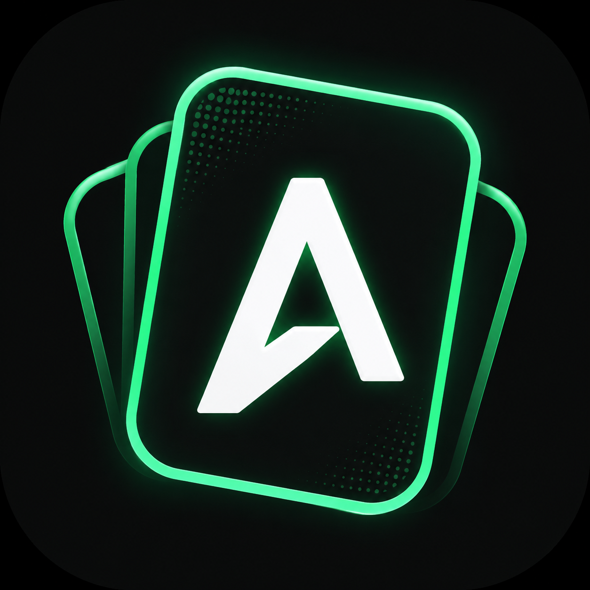

<p align="center">
  
</p>

<h1 align="center">AnkiiStudio</h1>

<p align="center">
  Transforme conteúdos em materiais de estudo, organize seus flashcards e prepare baralhos para o Anki.
</p>

<p align="center">
  <a href="https://github.com/LucasTsukasa/AnkiiStudio/releases">
    
  </a>
  
  
  <a href="LICENSE">
    
  </a>
</p>

<p align="center">
  <a href="https://github.com/LucasTsukasa/AnkiiStudio/releases"><strong>Download</strong></a>
  ·
  <a href="CHANGELOG.md">Changelog</a>
  ·
  <a href="https://github.com/LucasTsukasa/AnkiiStudio/issues">Issues</a>
  ·
  <a href="LICENSE">Licença</a>
</p>

---

## Sobre

**AnkiiStudio** é um aplicativo desktop para criação, organização e exportação de flashcards para o [Anki](https://apps.ankiweb.net/).

O projeto reúne em uma única interface as principais etapas de criação de um baralho: definição da estrutura dos cartões, geração ou importação de conteúdo, obtenção de imagens, geração de áudio, revisão e exportação.

Os projetos são exportados diretamente em `.apkg`, sem depender do AnkiConnect.

## Principais recursos

- Criação e gerenciamento de projetos de flashcards em uma biblioteca visual com pesquisa, filtros e ordenação.
- Duplicação de projetos preservando configurações, cartões e referências de mídia.
- Estrutura configurável de frente e verso.
- Múltiplas variações de estrutura no mesmo projeto, distribuídas de forma aleatória e equilibrada.
- Exportação direta para `.apkg`.
- Organização em baralhos e subbaralhos.
- Suporte a múltiplos idiomas.
- Interface disponível em Português (Brasil) e Inglês.
- Idioma de tradução configurável de forma independente por projeto.
- Modelos de flashcards prontos para idiomas compatíveis.
- Modelo personalizado para criação de estruturas próprias.
- Geração de conteúdo com Google Gemini, com quantidade fixa ou automática decidida pela IA dentro de um limite seguro.
- Presets reutilizáveis de criação para reaplicar idioma, estrutura, mídia, áudio e outras preferências sem armazenar API keys.
- Importação de conteúdo estruturado por JSON/TXT.
- Busca e processamento de imagens com Wikimedia Commons por padrão e fontes adicionais opcionais.
- Áudio por Tatoeba, Wikimedia Commons, VOICEVOX, Gemini TTS e ElevenLabs.
- Importação individual e em lote de arquivos de áudio próprios.
- Importação e remoção manual de imagens e áudios por cartão.
- Edição de vários cartões com salvamento conjunto de alterações pendentes.
- Exclusão simultânea de múltiplos cartões selecionados.
- Verificação opcional de novas versões publicadas no GitHub, com diálogo de atualização integrado ao visual do aplicativo.
- Perfis de voz configuráveis por idioma.
- Ajustes de voz por provedor.
- Reprodução de áudio dentro do aplicativo.
- Execução independente de tarefas de imagem e áudio, com progresso simultâneo sem uma tarefa sobrescrever o estado da outra.
- Temas do aplicativo **Claro**, **Escuro** e **Carmesim** (`#1A1A1A` + `#A4133C`).
- Barra lateral recolhível para liberar mais espaço para o conteúdo, com estado persistente.
- Configurações organizadas em uma janela própria com categorias.
- Personalização avançada da aparência dos cartões, incluindo tamanhos, imagem, espaçamento e densidade de layout.
- Roadmap integrado em linha do tempo, com planejamento carregado de arquivo separado e atualização pública pelo GitHub.
- Armazenamento seguro de credenciais pelo sistema operacional.
- Distribuição portátil para Windows.
- **AnkiiStudio Design System v1** sobre Qt/PySide6, com tokens, temas, componentes próprios e regras responsivas compartilhadas para manter a interface consistente conforme o aplicativo cresce.
- Arquitetura otimizada para projetos maiores, com carregamento sob demanda, consultas SQLite específicas, processamento em segundo plano e reutilização de conexões durante operações em lote.

## Design system da interface

A interface utiliza Qt/PySide6 como motor de janela e integração com o sistema operacional, mas a identidade visual é organizada pelo **AnkiiStudio Design System**. A camada própria centraliza tokens de cor/tipografia/espaçamento, temas, ícones, componentes reutilizáveis e breakpoints responsivos. Isso permite evoluir telas como Criar, Projetos, Configurações e futuros módulos de estudo sem depender da aparência padrão do Qt nem reimplementar recursos fundamentais de acessibilidade, foco, teclado e eventos.


## Desempenho

O AnkiiStudio utiliza carregamento sob demanda para reduzir o trabalho realizado durante a inicialização e evita carregar dados desnecessários de projetos grandes. Consultas de contagem, seções e amostras para pré-visualização são realizadas diretamente pelo SQLite sempre que possível, reduzindo a criação desnecessária de objetos em memória.

Operações em lote de imagem e áudio reutilizam conexões HTTP e recursos compartilhados durante o processamento. Atualizações de mídia relacionadas ao mesmo cartão são agrupadas em transações SQLite, e o cálculo de hashes de arquivos utiliza leitura em streaming para manter o consumo de memória previsível.

A interface também aplica debounce em operações que podem ser disparadas rapidamente, como pesquisa de projetos e atualização de pré-visualização. Etapas mais pesadas de importação e exportação são executadas fora da thread principal da interface quando aplicável, preservando a responsividade da janela durante operações demoradas.

## Fluxo de criação

```text
Criar projeto
      ↓
Selecionar idioma e modelo
      ↓
Definir a estrutura dos cartões
      ↓
Criar ou importar conteúdo
      ↓
Adicionar imagens e áudio
      ↓
Revisar
      ↓
Exportar para .apkg
      ↓
Importar no Anki
```

## Idiomas e modelos

O AnkiiStudio foi desenvolvido para trabalhar com um amplo catálogo de idiomas.

Dependendo do idioma selecionado, o aplicativo pode disponibilizar **modelos de flashcards prontos**, com estrutura e conteúdo previamente definidos para determinados objetivos de estudo.

Além dos modelos disponíveis, o modo **Personalizado** permite criar baralhos adaptados a diferentes necessidades, definindo elementos como:

- conteúdo;
- tema ou contexto;
- quantidade de cartões;
- estrutura da frente;
- estrutura do verso;
- método de criação.

A disponibilidade de modelos prontos pode evoluir conforme novos conteúdos forem adicionados ao projeto.

### Idioma da interface e idioma da tradução

O idioma da interface é uma preferência global e atualmente pode ser definido como **Português (Brasil)** ou **English**. A alteração é aplicada imediatamente, sem reiniciar o aplicativo, e permanece salva para as próximas execuções.

Cada projeto também possui um **Idioma da tradução** independente do idioma estudado e do idioma da interface. Esse idioma orienta os campos destinados ao estudante, como tradução, explicação, mnemônico e tradução de exemplos quando o conteúdo é gerado ou importado. Projetos existentes mantêm a configuração já salva mesmo que o idioma da interface seja alterado.

O catálogo de idiomas de tradução acompanha o catálogo multilíngue do aplicativo. O conteúdo interno revisado incluído com o programa possui localização própria em Português e Inglês nesta versão; outros idiomas podem ser utilizados nos fluxos Personalizado com geração ou importação de conteúdo.

## Estrutura dos flashcards

Os cartões podem ser compostos por diferentes componentes:

- Imagem
- Conteúdo principal
- Leitura
- Romaji / Romanização
- Tradução
- Áudio
- Exemplo
- Explicação
- Mnemônico

A estrutura disponível pode variar conforme o modelo utilizado e pode ser personalizada quando o modelo permitir.

### Personalização visual

Em **Configurações → Aparência**, é possível definir o **tema padrão global dos flashcards**. Novos projetos recebem uma cópia desse tema como ponto de partida, sem alterar projetos já existentes. Em **Projetos → Estrutura e aparência**, cada projeto continua podendo aplicar o padrão global ou ajustar sua própria estrutura, tema e aparência. Além das cores e da fonte, é possível configurar:

- tamanho do Conteúdo principal;
- tamanho da Leitura;
- tamanho da Romanização;
- tamanho da Tradução;
- tamanho do Exemplo;
- tamanho da Explicação;
- tamanho do Mnemônico;
- altura máxima da imagem;
- largura máxima do cartão;
- espaçamento interno;
- espaço entre componentes.

Os presets **Compacto**, **Normal** e **Espaçoso** aplicam combinações prontas de dimensões. Ao modificar manualmente os controles de layout, o projeto passa para o modo **Personalizado**.

### Variações de estrutura

Um mesmo projeto pode conter mais de uma variação de cartão. Cada variação possui sua própria composição de frente e verso.

Quando duas ou mais variações são configuradas, o AnkiiStudio distribui os conteúdos de forma **aleatória e equilibrada** entre elas. Isso permite combinar diferentes formas de estudo — por exemplo, reconhecimento, compreensão auditiva, produção e associação visual — dentro do mesmo baralho, sem duplicar automaticamente todos os conteúdos.

## Criação de conteúdo

O AnkiiStudio oferece diferentes formas de adicionar conteúdo aos projetos.

### Conteúdo com IA

A integração com **Google Gemini** permite gerar conteúdo estruturado de acordo com o idioma, modelo e configuração definidos no projeto. Na geração interna, o AnkiiStudio valida explicitamente o idioma-alvo/idioma de tradução retornados e, quando a quantidade é fixa, exige exatamente o número solicitado antes de criar o projeto. O schema enviado à Gemini também acompanha a estrutura escolhida: campos pedagógicos selecionados, como Exemplo, Explicação e Mnemônico, são exigidos na própria resposta estruturada e validados novamente antes da criação.

Na criação personalizada, a quantidade pode ser definida manualmente ou deixada em **Automática**. Nesse modo, a IA escolhe uma quantidade adequada para cobrir o conteúdo solicitado, respeitando um limite máximo de segurança e evitando completar artificialmente a saída apenas para atingir um número fixo. Modelos internos com quantidade própria continuam utilizando a contagem determinada pelo conteúdo do modelo.

As configurações mais usadas também podem ser salvas como **presets de criação**. Um preset pode reaplicar idioma, idioma da tradução, modelo, estrutura, tema do cartão, opções de áudio, preferências de voz por provedor e ajustes do VOICEVOX. Credenciais e API keys não são copiadas para o preset.

Na página **Projetos**, os campos **Exemplo**, **Explicação** e **Mnemônico** também possuem uma ação discreta `✨` para gerar ou regenerar somente aquele componente com IA. A chamada acontece apenas quando o usuário aciona o botão, reutiliza a chave/modelo Gemini configurados e deixa o resultado como alteração pendente para revisão antes de salvar.

### Importação

Também é possível importar conteúdo previamente preparado em formatos estruturados, permitindo utilizar respostas geradas externamente ou materiais próprios. O mesmo verificador é usado para texto colado e arquivos JSON/TXT. Respostas de IA com invólucros comuns — como um único bloco `json`, texto simples antes/depois do objeto, BOM, vírgulas finais e alguns casos reconhecíveis de aspas não escapadas — podem ser normalizadas de forma conservadora; conteúdo estruturalmente ambíguo continua sendo rejeitado em vez de ser adivinhado.

### Conteúdo interno

Alguns modelos podem utilizar conteúdo fornecido diretamente pelo AnkiiStudio, sem necessidade de geração por IA.

## Imagens

O **Wikimedia Commons** permanece como a fonte de imagens habilitada por padrão. Em **Configurações**, o usuário pode ativar fontes adicionais quando quiser ampliar os resultados da busca:

- Pixabay
- Pexels

Pixabay e Pexels utilizam as API keys configuradas pelo próprio usuário. As fontes adicionais permanecem desabilitadas até serem ativadas manualmente.

Na pesquisa manual, um filtro ao lado do campo de busca permite restringir temporariamente a consulta às fontes que já estão habilitadas nas Configurações. Fontes desativadas continuam visíveis no filtro, mas não podem ser selecionadas até serem habilitadas globalmente.

O aplicativo pesquisa, seleciona, baixa e otimiza as mídias antes de vinculá-las aos cartões. Na busca automática/em lote, termos visuais explícitos (`image_search_terms`) continuam tendo prioridade quando existem. Quando o cartão não possui esses termos, o **Conteúdo principal original** é pesquisado primeiro e a tradução é usada apenas como fallback. Assim, caracteres como `お` são consultados como `お`, em vez de começar pela tradução latina `O`. O AnkiiStudio também reduz a aceitação de resultados do Wikimedia sem relação clara com consultas não latinas.

Na pesquisa manual de um único cartão, o **conteúdo principal original** é mantido como consulta principal. Tradução, leitura, romanização e termos visuais disponíveis no cartão aparecem como buscas auxiliares em miniaturas menores, permitindo comparar alternativas sem substituir o termo original. A janela apresenta os resultados em miniaturas visuais, com pré-visualização compacta, metadados organizados e sugestões auxiliares em seções menores.

Também é possível **importar uma imagem local** diretamente para um cartão ou **remover a imagem associada**. Quando disponíveis, informações de origem, autoria e licença das imagens obtidas por fontes externas são preservadas internamente.

## Áudio

O AnkiiStudio pode utilizar gravações humanas, síntese de voz e arquivos fornecidos pelo próprio usuário.

As configurações **globais** de provedores e perfis de voz ficam na janela **Configurações → Áudio**. Nela também é possível carregar, escolher, ajustar e ouvir a voz padrão do VOICEVOX, além de ouvir perfis Gemini TTS e ElevenLabs. As decisões específicas de cada projeto — modo de seleção, provedores permitidos, voz fixa/preferida e ajustes do VOICEVOX — ficam dentro do próprio projeto, em **Projetos → Áudio do projeto**, e também podem participar dos presets de criação. Na tela **Criar → Mídias e áudio → Avançado**, essas vozes podem ser escolhidas/testadas antes da criação e salvas no preset.

### Tatoeba

O AnkiiStudio pode procurar uma gravação humana correspondente ao conteúdo do cartão no Tatoeba. Quando uma correspondência reutilizável está disponível, a gravação pode ser associada ao cartão com os metadados de origem, autoria e licença preservados.

### Wikimedia Commons

Permite utilizar gravações disponíveis no Wikimedia quando houver mídia compatível com o conteúdo do cartão.

### VOICEVOX

Integração com o engine local do VOICEVOX.

O aplicativo permite consultar personagens e estilos disponíveis no engine, selecionar vozes e ajustar parâmetros de síntese.

### Gemini TTS

Permite configurar perfis de voz utilizando modelos e vozes compatíveis com o Google Gemini.

### ElevenLabs

Permite cadastrar perfis utilizando modelos e Voice IDs disponíveis para a conta configurada.

Os perfis podem incluir ajustes como:

- estabilidade;
- similaridade;
- estilo;
- velocidade;
- Speaker Boost.

> A disponibilidade de modelos, vozes, cotas e recursos depende dos serviços externos e do plano utilizado em cada plataforma.

### Importar áudio

Arquivos locais podem ser associados diretamente aos cartões, sem depender de serviços externos.

A importação em lote permite selecionar vários arquivos ou uma pasta e relacionar cada áudio ao cartão pelo nome do arquivo. O campo usado para a correspondência pode ser escolhido pelo usuário, incluindo conteúdo principal, leitura, romanização ou tradução.

Exemplo:

```text
あ.wav  →  cartão com conteúdo “あ”
い.wav  →  cartão com conteúdo “い”
う.wav  →  cartão com conteúdo “う”
```

Antes da aplicação, o AnkiiStudio apresenta as correspondências encontradas e identifica arquivos sem cartão correspondente, casos ambíguos e cartões que já possuem áudio.

## Projetos e edição

A página **Projetos** funciona como uma biblioteca visual. É possível pesquisar por nome ou tema, filtrar por idioma e ordenar por atividade recente, nome ou quantidade de cartões. Cada projeto possui um menu visível `⋯` e um menu de contexto com ações como abrir, duplicar e excluir.

Ao abrir um projeto, as ferramentas ficam reunidas em abas de **Cartões**, **Estrutura e aparência** e **Áudio do projeto**. Assim, a antiga separação de Modelos e Áudios na navegação principal deixa de exigir que o usuário escolha o mesmo projeto novamente em telas diferentes.

## Edição de cartões

Alterações feitas em cartões podem permanecer pendentes enquanto o usuário navega entre diferentes itens do mesmo projeto. O botão **Salvar alterações** grava todas as modificações pendentes em conjunto.

Ao tentar fechar o aplicativo, trocar de projeto, exportar ou executar uma operação que dependa dos dados persistidos, o AnkiiStudio avisa quando existem alterações não salvas e permite salvar, continuar sem salvar ou cancelar a ação.

A tabela de cartões também suporta seleção múltipla para exclusão de vários cartões em uma única confirmação.

Campos de texto participam do fluxo padrão de **Desfazer/Refazer** (`Ctrl+Z`, `Ctrl+Y`/`Ctrl+Shift+Z`). Os menus de contexto nativos do Qt acompanham o idioma da interface quando o pacote de tradução correspondente está disponível no runtime Qt.

Operações em lote de **imagem** e **áudio** mantêm tarefas independentes na interface. Elas podem progredir simultaneamente sem compartilhar a mesma linha de progresso, e as atualizações de mídia no SQLite alteram somente os campos de mídia correspondentes para evitar que um worker sobrescreva o resultado do outro.

## Exportação para o Anki

Os projetos são exportados no formato:

```text
.apkg
```

O arquivo pode ser importado diretamente pelo Anki.

Também é possível organizar o conteúdo em subbaralhos utilizando a estrutura:

```text
Baralho::Subbaralho
```

Quando uma mídia opcional estiver ausente, a exportação ainda pode ser realizada se o cartão continuar contendo informações suficientes para estudo.

## Download

A versão portátil para Windows está disponível na página de:

**[GitHub Releases](https://github.com/LucasTsukasa/AnkiiStudio/releases)**

### Como executar

1. Baixe o arquivo `.zip` da versão desejada.
2. Extraia todo o conteúdo.
3. Execute `AnkiiStudio.exe`.

Estrutura típica da distribuição:

```text
AnkiiStudio/
├── AnkiiStudio.exe
├── _internal/
└── data/
```

> A pasta `_internal` contém dependências necessárias para execução e deve permanecer junto do aplicativo.

A versão portátil não exige uma instalação local do Python.

## Atualizações

Em **Configurações**, a opção **Procurar atualizações automaticamente** controla a verificação de novas versões publicadas no GitHub. Quando habilitada, a consulta é feita na inicialização. Também existe uma ação para verificar manualmente a qualquer momento.

Quando uma versão mais recente compatível com o canal atual é encontrada, o AnkiiStudio apresenta uma janela própria com versão instalada, versão disponível, canal e notas da atualização antes do download. Na distribuição portátil para Windows, o pacote é preparado para substituir os arquivos do aplicativo preservando a pasta `data/` e reiniciar o AnkiiStudio após a atualização. O atualizador aceita tanto o executável na raiz do ZIP quanto dentro de uma única pasta contêiner do build portátil.

## Interface e configurações

A barra lateral pode ser **recolhida para o modo somente ícones**, ampliando a área útil das páginas. O estado é salvo e reaplicado na próxima execução.

As **Configurações** são abertas em uma janela própria, com navegação por categorias para Geral, Aparência, IA e APIs, Imagens, Áudio e Atualizações. Isso mantém credenciais e opções globais fora das páginas específicas dos projetos.

A pré-visualização de cartões dentro de **Estrutura e aparência** utiliza o mesmo renderer/CSS empregado na exportação e segue um fluxo mais próximo da revisão no Anki: primeiro mostra a frente e permite revelar a resposta. Também é possível alternar entre uma largura de desktop e uma visualização mais estreita de celular.

## Roadmap

A página **Roadmap** apresenta o planejamento do projeto como uma linha do tempo. O conteúdo distribuído com o aplicativo fica em `ankiistudio/resources/roadmap.json`, separado do código da interface. Títulos, descrições e listas definidos nesse arquivo são exibidos exatamente no idioma em que forem escritos; somente os elementos fixos da página e os status são traduzidos pela interface.

Na primeira abertura da página durante a sessão, se houver conexão disponível, o AnkiiStudio tenta obter a versão pública mais recente desse arquivo no repositório GitHub. Se a consulta falhar, utiliza a última cópia em cache ou o arquivo incluído na versão instalada. Assim, alterações de planejamento podem ser publicadas por commit sem exigir uma nova versão apenas para atualizar o texto do Roadmap.

Os estados públicos utilizados são:

- `✓ CONCLUÍDO`;
- `◉ EM DESENVOLVIMENTO`;
- `◇ PLANEJADO`.

## Assinatura do executável no Windows

O build possui um gancho opcional de assinatura Authenticode em `scripts/sign_windows.ps1`. Quando um certificado de assinatura estiver configurado no ambiente de build, o executável é assinado e verificado antes da criação do ZIP portátil. Sem certificado, o build continua e informa explicitamente que o artefato permanece sem assinatura.

Certificados, senhas e outros segredos de assinatura nunca devem ser adicionados ao repositório.

## Dados locais

Os dados criados durante o uso ficam na pasta `data/` da versão portátil:

```text
data/
├── database/
├── media/
│   ├── images/
│   └── audio/
├── exports/
├── cache/
└── logs/
```

Essa estrutura mantém projetos, mídias e arquivos de execução separados dos arquivos internos do aplicativo.

## Segurança e credenciais

As API keys configuradas pelo usuário não são armazenadas em texto simples dentro da pasta portátil.

O AnkiiStudio utiliza `keyring` para integrar-se ao gerenciador seguro de credenciais do sistema operacional.

Serviços externos podem exigir credenciais próprias, como:

- Google Gemini
- ElevenLabs
- Pixabay
- Pexels

Cada usuário deve utilizar suas próprias credenciais e respeitar os termos dos respectivos serviços.

## Desenvolvimento

Para executar o projeto a partir do código-fonte, utilize Python **3.11 ou superior**.

### Criar o ambiente virtual

```bat
python -m venv .venv
.venv\Scripts\activate.bat
python -m pip install --upgrade pip
python -m pip install -r requirements.txt
```

No Windows, `python` também pode ser substituído pelo Python Launcher apontando para uma versão compatível instalada, por exemplo `py -3.11`, `py -3.12`, `py -3.13` ou superior.

### Executar

```bat
python run.py
```

Ou diretamente:

```bat
.venv\Scripts\python.exe run.py
```

## Testes

Instale as dependências de desenvolvimento:

```bat
pip install -r requirements-dev.txt
```

Execute:

```bat
pytest
```

## Build para Windows

O projeto inclui um script para gerar a distribuição portátil:

```bat
powershell -ExecutionPolicy Bypass -File .\scripts\build_windows.ps1
```

O processo utiliza PyInstaller e gera o pacote de distribuição na pasta `release/`.

## Estrutura do repositório

```text
AnkiiStudio/
├── ankiistudio/
│   ├── data/
│   ├── languages/
│   ├── resources/
│   ├── services/
│   └── ui/
│       └── design_system/
├── scripts/
├── tests/
├── AnkiiStudio.spec
├── CHANGELOG.md
├── LICENSE
├── pyproject.toml
├── requirements.txt
├── requirements-dev.txt
└── run.py
```

| Diretório | Finalidade |
|---|---|
| `ankiistudio/` | Código principal da aplicação |
| `ankiistudio/data/` | Conteúdo interno distribuído com o programa |
| `ankiistudio/languages/` | Pacotes de tradução da interface |
| `ankiistudio/resources/` | Ícones, Roadmap e demais recursos distribuídos |
| `ankiistudio/services/` | Serviços, integrações e regras de negócio |
| `ankiistudio/ui/` | Interface gráfica |
| `ankiistudio/ui/design_system/` | Design tokens, temas e componentes reutilizáveis da interface |
| `tests/` | Testes automatizados |
| `scripts/` | Scripts auxiliares e de build |

## Changelog

O histórico de alterações está disponível em [CHANGELOG.md](CHANGELOG.md).

## Licença

O AnkiiStudio é distribuído sob a **GNU General Public License v3.0 (GPL-3.0)**.

Consulte [LICENSE](LICENSE) para os termos completos.

Bibliotecas, APIs, serviços e mídias de terceiros permanecem sujeitos às suas próprias licenças e termos de uso.

## Autor

Desenvolvido por **Lucas Tsukasa**.

[GitHub @LucasTsukasa](https://github.com/LucasTsukasa)
